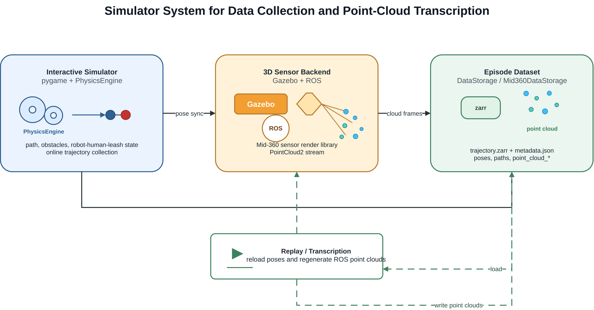

# Human-Safe Diffusion Planning and Interaction-Aware Compliance Control for Guide Robots

## Abstract

导盲机器人需要在复杂环境中安全地引导人类到达目标位置。与普通移动机器人导航不同，导盲机器人不仅需要避免机器人自身碰撞，还需要显式考虑**被引导人的身体安全**、**运动舒适性**以及人机物理交互中的**主动性变化**。现有 diffusion policy 可以从示范数据中学习平滑的运动策略，SafeDiffuser 类方法也可以通过 QP 或 safety projection 对动作进行安全修正。然而，现有方法通常主要关注机器人自身安全，缺少对人体碰撞风险的显式建模。

此外，传统 delay harness model 通常假设机器人先执行动作，然后人类根据牵引方向和绳长约束被动随动。这种模型适合描述简单的被动跟随场景，但无法表达真实交互中人类主动避障、迟疑、抵抗或短时主导运动的情况。为此，本文提出一种面向导盲机器人的 human-safe diffusion planning and interaction-aware compliance control 框架。该方法首先在 SafeDiffuser 风格的 QP projection 中加入 **human collision constraint**，使规划器同时考虑机器人安全和人体安全。其次，本文在 delay harness model 基础上**引入 active human motion model，并估计人类主动性系数**。进一步，本文使用 HMM 根据轨迹和交互特征识别当前状态是 robot-leading、human-leading 还是 uncertain。最后，本文提出 **interaction-aware compliance control**，仅在 HMM 识别为 human-leading 时启用 compliance control，从而在顺应人类意图的同时避免全程顺应导致的效率下降。仿真和真实实验验证了本文方法在人体安全、交互适应性和任务效率方面的优势。

## Keywards

guide robot，diffusion policy，safe planning，human-robot interaction，compliance control，human motion modeling，hidden Markov model。

---

# I. Introduction

## A. Background and Motivation

导盲机器人需要通过物理牵引、空间引导或共享控制的方式帮助人类完成导航任务。在 leash-based 或 harness-based guide robot 系统中，机器人与人之间存在物理耦合关系，因此机器人的动作会直接影响人的运动。

与普通移动机器人不同，导盲机器人需要同时考虑以下因素：

* 机器人自身安全；
* 被引导人的身体安全；
* 人机牵引约束；
* 人类运动舒适性；
* 人类主动意图；
* 导航任务效率。

一个对机器人安全的轨迹不一定对人安全。例如，机器人绕过障碍物时自身可能不会发生碰撞，但由于人类存在运动滞后、身体宽度、侧向偏移或绳索牵引方向变化，人可能被拉向障碍物。因此，导盲机器人规划不能只考虑 robot collision，还应显式考虑 human collision。

同时，被引导人并不总是完全被动的。人在真实交互中可能会主动避障、减速、停顿、抵抗机器人牵引，或者短时间内主导运动方向。因此，导盲机器人控制应被建模为一个动态人机交互问题，而不是简单的机器人路径跟踪问题。

## B. Limitations of Existing Methods

现有方法主要存在以下不足。

第一，diffusion policy 能够从示范数据中学习平滑、复杂的动作分布，但原始 diffusion policy 缺少显式安全约束，无法保证生成动作一定满足安全要求。

第二，SafeDiffuser 类方法通过 safety projection 或 QP-based correction 对 diffusion action 进行修正，但大多主要关注机器人自身与障碍物之间的安全距离，**较少显式建模被引导人的身体碰撞风险**。

第三，delay harness model 通常假设机器人先运动，人类随后根据牵引约束被动更新位置。这种模型适合描述人被机器人带动的情况，但无法表达**真实人类的主动运动**。

第四，compliance control 可以提高人机交互舒适性，使机器人顺应人类意图。然而，如果全程启用 **compliance control，机器人可能过度让步，导致路径变长、速度下降和任务效率降低。**

## C. Contributions

本文主要贡献如下。

1. **Human-safe diffusion planning.**
   本文在 SafeDiffuser-style constrained diffusion planning 中加入 human collision constraint，并通过 QP-based action projection 同时保证机器人安全和人体安全。

2. **Active-passive interaction modeling.**
   本文在 delay harness model 基础上引入 stochastic human active motion，将人的运动表示为主动运动和被动随动运动的加权组合，并估计 human activeness coefficient。

3. **HMM-based interaction state recognition.**
   本文使用 hidden Markov model 根据时间序列交互特征识别当前状态，包括 robot-leading、human-leading 和 uncertain。

4. **Interaction-aware compliance control.**
   本文提出 HMM-triggered compliance controller，仅在 human-leading 状态下启用 compliance control，从而避免 full-time compliance 带来的效率下降。

## D. Paper Organization

本文其余部分组织如下。Section II 回顾相关工作。Section III 给出问题定义。Section IV 介绍本文方法。Section V 介绍仿真实验。Section VI 介绍真实机器人实验。Section VII 讨论方法优势与局限。Section VIII 总结全文。

---

# II. Related Work

## A. Guide Robots and Physical Human-Robot Interaction

导盲机器人通过方向提示、物理牵引或共享控制帮助人类完成导航任务。相比普通移动机器人，导盲机器人必须同时考虑环境安全和人机交互质量。

已有研究关注了导盲机器人路径规划、避障、人机协同导航和物理人机交互。然而，许多方法主要关注机器人轨迹本身，对被引导人的人体安全建模不足。

在 leash-based 或 harness-based 系统中，机器人和人之间存在物理耦合。这种耦合会带来人类响应延迟、牵引约束、人机速度不一致以及 robot intention 和 human intention 之间的冲突。因此，导盲机器人需要同时建模 robot motion、human motion 和 interaction state。

Delay harness model 通常假设机器人先执行动作，然后人类根据绳索方向和绳长约束进行被动随动。该模型可以简单有效地描述 passive-following 行为。

但是，真实人类不是完全被动的。在交互过程中，人类可能主动避障、调整方向、减速、停顿、抵抗机器人，或者短时主导运动方向。因此，更合理的人类运动模型应同时包含 passive harness-following motion 和 active human motion。

## B. Diffusion Policy and Safe Diffusion Planning

Diffusion policy 已被用于机器人行为学习和轨迹生成。它能够表示多模态动作分布，并从 demonstration 中学习平滑的动作序列。

对于导盲机器人而言，diffusion policy 的优势在于可以学习复杂的人机协同行为。然而，标准 diffusion policy 通常缺乏显式安全保证，生成动作可能导致机器人碰撞、人体碰撞或牵引约束违反。

Safe diffusion planning 通常通过 safety filter、action projection 或 quadratic programming 对 diffusion action 进行修正。其基本形式可以写为：

$$
\begin{aligned}
\mathbf{a}_t^*
&=
\arg\min_{\mathbf{a}}
\left\|
\mathbf{a}
-
\mathbf{a}_t^{diff}
\right\|^2
\end{aligned}
$$
其中，$\mathbf{a}_t^{diff}$ 是 diffusion policy 生成的原始动作，$\mathbf{a}_t^*$ 是经过安全投影后的动作。

现有 safe diffusion 方法通常主要考虑机器人自身的碰撞约束。对于导盲机器人而言，这种 robot-only safety 并不充分，因为即使机器人不碰撞，被引导人的身体轨迹仍可能与障碍物发生碰撞。

## C. Compliance Control in Human-Robot Interaction

Compliance control、impedance control 和 admittance control 广泛用于物理人机交互。它们可以使机器人对外部人类输入作出柔顺响应，提高交互舒适性。

在导盲机器人场景中，compliance control 可以帮助机器人顺应人类主动意图。然而，如果机器人全程顺应，人类的随机扰动或短时偏移可能持续影响机器人运动，导致导航效率下降。因此，本文提出 interaction-aware compliance，仅在识别出 human-leading 状态时启用顺应控制。

---

# III. Problem Formulation

## A. System Model

本文考虑一个机器人和一个人通过 leash 或 harness 相连，并在包含静态障碍物的二维环境中运动。

系统状态定义为：

$$
\mathbf{x}*t =
[
\mathbf{p}*{r,t},
\theta_{r,t},
\mathbf{v}*{r,t},
\mathbf{p}*{h,t},
\mathbf{v}_{h,t},
\mathbf{l}_t,
d_t
]
$$

其中，$\mathbf{p}{r,t}$ 表示机器人位置，$\theta{r,t}$ 表示机器人朝向，$\mathbf{v}{r,t}$ 表示机器人速度，$\mathbf{p}{h,t}$ 表示人类位置，$\mathbf{v}_{h,t}$ 表示人类速度，$\mathbf{l}_t$ 表示牵引方向，$d_t$ 表示机器人和人之间的距离。

机器人动作定义为：

$$
\mathbf{a}_t =
[
v_t,
\omega_t
]
$$

其中，$v_t$ 表示线速度指令，$\omega_t$ 表示角速度指令。

## B. Planning Objective

规划目标是生成机器人动作序列：

$$
\mathbf{a}_{0:T}
================

{
\mathbf{a}_0,
\mathbf{a}_1,
...,
\mathbf{a}_T
}
$$

使人机系统安全、高效地到达目标位置。

该目标包括：

* 到达目标点；
* 避免机器人碰撞；
* 避免人体碰撞；
* 满足 leash 或 harness 约束；
* 保持轨迹平滑；
* 在必要时顺应人类意图；
* 避免不必要的 compliance。

## C. Robot Safety Constraint

机器人需要与障碍物保持安全距离：

$$
d(\mathbf{p}_{r,t}, \mathcal{O})
\geq
d_r^{safe}
$$

其中，$\mathcal{O}$ 表示障碍物集合，$d_r^{safe}$ 表示机器人安全距离。

## D. Human Safety Constraint

被引导人也需要与障碍物保持安全距离：

$$
d(\mathbf{p}_{h,t}, \mathcal{O})
\geq
d_h^{safe}
$$

其中，$d_h^{safe}$ 表示人体安全距离。

这一约束非常关键，因为人体轨迹可能由于运动滞后、身体宽度、绳索方向和人机距离等因素与机器人轨迹不同。

## E. Leash or Harness Constraint

机器人和人之间的距离应保持在合理范围内：

$$
d_{min}
\leq
\left|
\mathbf{p}_{r,t}
----------------

\mathbf{p}*{h,t}
\right|
\leq
d*{max}
$$

其中，$d_{min}$ 和 $d_{max}$ 分别表示最小和最大可行牵引距离。

## F. Interaction States

本文将交互状态定义为隐变量：

$$
z_t
\in
{
\text{Robot-leading},
\text{Human-leading},
\text{Uncertain}
}
$$

其中：

**Robot-leading** 表示机器人主要决定运动方向，人类主要被动跟随。

**Human-leading** 表示人类主动影响运动方向或速度，机器人应顺应人类意图。

**Uncertain** 表示交互状态处于同步、冲突、过渡或观测不明确状态。

---

# IV. Proposed Method

## A. Framework Overview

本文方法包含四个主要模块：

1. diffusion policy 生成候选动作；
2. human-safe QP projection 修正动作；
3. active-passive human interaction model 预测人类运动；
4. HMM-based interaction recognition 判断交互状态，并触发 interaction-aware compliance control。

整体流程为：

Observation
→ Diffusion Policy
→ Human-Safe QP Projection
→ Active-Passive Human Motion Model
→ HMM Interaction Recognition
→ Interaction-Aware Compliance Control
→ Robot Execution

## B. Diffusion Policy Baseline

给定当前观测 $\mathbf{o}_t$，diffusion policy 生成候选机器人动作：

$$
\mathbf{a}*t^{diff}
\sim
\pi*\theta
(
\mathbf{a}_t
\mid
\mathbf{o}_t
)
$$

观测可以包含：

$$
\mathbf{o}_t =
[
\mathbf{x}_t,
\mathbf{g},
\mathcal{O},
\mathbf{h}_t
]
$$

其中，$\mathbf{x}_t$ 表示人机系统状态，$\mathbf{g}$ 表示目标位置，$\mathcal{O}$ 表示障碍物信息，$\mathbf{h}_t$ 表示历史观测。

Diffusion policy 能够生成平滑且接近示范数据分布的动作，但其输出动作可能违反机器人安全、人体安全或牵引约束。

## C. Human-Safe QP Projection

为了保证安全，本文使用 QP-based safety layer 将 diffusion action 投影到可行安全动作空间中：

$$
\mathbf{a}_t^*
==============

\arg\min_{\mathbf{a}}
\left|
\mathbf{a}
----------

\mathbf{a}_t^{diff}
\right|^2
$$

约束条件为：

$$
d(\hat{\mathbf{p}}_{r,t+1}, \mathcal{O})
\geq
d_r^{safe}
$$

$$
d(\hat{\mathbf{p}}_{h,t+1}, \mathcal{O})
\geq
d_h^{safe}
$$

$$
d_{min}
\leq
\left|
\hat{\mathbf{p}}_{r,t+1}
------------------------

\hat{\mathbf{p}}*{h,t+1}
\right|
\leq
d*{max}
$$

其中，$\hat{\mathbf{p}}*{r,t+1}$ 和 $\hat{\mathbf{p}}*{h,t+1}$ 分别表示执行动作 $\mathbf{a}$ 后预测得到的机器人和人类下一时刻位置。

第一个约束保证机器人安全。第二个约束是本文提出的 human collision constraint，用于显式保证人体安全。第三个约束保证 leash 或 harness 关系保持合理。

## D. Delay Harness Baseline

Delay harness model 假设机器人先执行动作，然后人类根据牵引方向和绳长约束被动移动。

被动人类运动可以写为：

$$
\mathbf{u}_{h,t}^{passive}
==========================

f_{harness}
(
\mathbf{p}*{r,t},
\mathbf{p}*{h,t},
\mathbf{a}_{r,t},
d_t
)
$$

其中，$\mathbf{u}_{h,t}^{passive}$ 表示由机器人运动和牵引约束诱导的人类被动运动。

该模型简单、可解释，适合仿真中的被动随动场景，但它默认人类只是被动跟随者，无法表达主动避障、迟疑、抵抗或 human-leading 行为。

## E. Active-Passive Human Motion Model

为了建模人类主动性，本文引入 human active motion：

$$
\mathbf{u}_{h,t}^{active}
$$

该主动运动可以表示：

* 人类随机步态扰动；
* 局部避障行为；
* 迟疑或减速；
* 对机器人牵引的抵抗；
* 短时 human-leading 方向；
* 人类偏好的运动方向。

最终的人类运动建模为主动运动和被动运动的混合：

$$
\mathbf{u}_{h,t}
================

k_t
\mathbf{u}*{h,t}^{active}
+
(1-k_t)
\mathbf{u}*{h,t}^{passive}
$$

其中，$k_t$ 是 human activeness coefficient。

当 $k_t = 0$ 时，表示人类完全被动随动。

当 $k_t = 1$ 时，表示人类完全主动运动。

当 $0 < k_t < 1$ 时，表示人类运动由主动意图和被动牵引共同决定。

## F. Human Activeness Estimation

给定观测到的人类运动 $\mathbf{u}_{h,t}^{obs}$，可以通过最小化预测误差估计 $k_t$：

$$
k_t^*
=====

\arg\min_{k_t}
\left|
\mathbf{u}_{h,t}^{obs}
----------------------

\left[
k_t
\mathbf{u}*{h,t}^{active}
+
(1-k_t)
\mathbf{u}*{h,t}^{passive}
\right]
\right|^2
$$

估计得到的 $k_t^*$ 可以作为 HMM 的输入特征之一。

较大的 $k_t^*$ 表示当前人类主动性更强；较小的 $k_t^*$ 表示当前人类更接近被动跟随。

## G. HMM-Based Interaction Recognition

交互状态被建模为隐变量：

$$
z_t
\in
{
\text{Robot-leading},
\text{Human-leading},
\text{Uncertain}
}
$$

HMM 的观测特征定义为：

$$
\mathbf{y}_t =
[
s_t^{lead},
s_t^{extension},
v_t^{shared},
\Delta\theta_t,
k_t
]
$$

其中，$s_t^{lead}$ 表示 robot lead score，$s_t^{extension}$ 表示 link extension score，$v_t^{shared}$ 表示 shared speed，$\Delta\theta_t$ 表示机器人和人类速度方向差，$k_t$ 表示估计得到的人类主动性系数。

HMM 联合概率为：

$$
p(z_{1:T}, \mathbf{y}_{1:T})
============================

p(z_1)
\prod_{t=2}^{T}
p(z_t \mid z_{t-1})
\prod_{t=1}^{T}
p(\mathbf{y}_t \mid z_t)
$$

通过 Viterbi 解码得到最可能的状态序列：

$$
z_{1:T}^*
=========

\arg\max_{z_{1:T}}
p(z_{1:T}
\mid
\mathbf{y}_{1:T})
$$

相比逐帧分类，HMM 可以利用时间连续性，减少状态识别抖动，提高 interaction state recognition 的稳定性。

## H. Interaction-Aware Compliance Control

Full-time compliance control 在每个时刻都启用顺应控制：

$$
\mathbf{a}_t
============

\mathbf{a}_t^{plan}
+
\mathbf{a}_t^{comp}
$$

其中，$\mathbf{a}_t^{plan}$ 表示规划动作，$\mathbf{a}_t^{comp}$ 表示顺应控制修正项。

虽然 full-time compliance 可以提高舒适性，但它可能使机器人持续受到人类随机扰动影响，导致导航效率下降。

因此，本文提出 interaction-aware compliance control：

$$
\mathbf{a}_t =
\begin{cases}
\mathbf{a}_t^{plan}
+
\mathbf{a}_t^{comp},
&
z_t
===

\text{Human-leading}
\
\mathbf{a}_t^{plan},
&
z_t
===

\text{Robot-leading}
\
\mathbf{a}_t^{plan}
+
\lambda
\mathbf{a}_t^{comp},
&
z_t
===

\text{Uncertain}
\end{cases}
$$

其中，$0 < \lambda < 1$ 表示 uncertain 状态下的部分顺应强度。

该设计使机器人只在 human-leading 状态下充分顺应人类意图，在 robot-leading 状态下保持高效引导，在 uncertain 状态下采用保守的部分顺应策略。

## I. Algorithm Summary

**Algorithm 1: Human-Safe Diffusion Planning with Interaction-Aware Compliance**

输入：当前观测 $\mathbf{o}_t$、机器人状态、人类状态、障碍物地图、训练好的 diffusion policy 和 HMM model。

输出：最终机器人动作 $\mathbf{a}_t$。

1. 从 diffusion policy 采样候选动作 $\mathbf{a}_t^{diff}$。
2. 预测机器人下一时刻位置 $\hat{\mathbf{p}}_{r,t+1}$。
3. 使用 interaction model 预测人类下一时刻位置 $\hat{\mathbf{p}}_{h,t+1}$。
4. 求解 human-safe QP projection，得到 $\mathbf{a}_t^*$。
5. 估计 human activeness coefficient $k_t$。
6. 提取 HMM 观测特征 $\mathbf{y}_t$。
7. 使用 HMM 推断 interaction state $z_t$。
8. 根据 $z_t$ 启用对应的 compliance control。
9. 执行最终机器人动作 $\mathbf{a}_t$。

---

# V. Simulation Experiments

## A. Simulation Setup

仿真实验包含多种导盲机器人导航场景：

* 直线走廊引导；
* 窄通道通过；
* 障碍物绕行；
* 急转弯；
* 人类迟疑；
* 人类主动偏移；
* 人类抵抗；
* 短时 human-leading 行为。

数据采集与点云生成流程如 @fig-simulator-system 所示。pygame 负责交互与可视化，PhysicsEngine 更新人机状态；可选 Mid-360 后端将状态同步到 Gazebo，经 sensor render library 和 ROS PointCloud2 生成点云，并与轨迹一起写入 episode。回放阶段可重放已有 episode，批量补生成点云。

{#fig-simulator-system width="95%"}

仿真系统包含：

* 机器人动力学模型；
* 人类运动模型；
* leash 或 harness 约束；
* 障碍物地图；
* 目标点；
* active-passive human motion model。

## B. Compared Methods

实验对比以下方法：

1. **Diffusion Policy**
   原始 diffusion policy，不包含显式 safety projection。

2. **SafeDiffuser**
   加入机器人自身安全约束的 diffusion planner。

3. **Delay Harness**
   使用纯被动人类随动模型，不包含主动人类运动。

4. **Full-Time Compliance**
   全程启用 compliance control。

5. **Ours without Human Collision Constraint**
   去掉 human collision constraint 的消融版本。

6. **Ours without HMM-Triggered Compliance**
   去掉 HMM-triggered compliance 的消融版本。

7. **Ours Full System**
   本文完整方法。

## C. Evaluation Metrics

### 1) Safety Metrics

* robot collision rate；
* human collision rate；
* minimum robot-obstacle distance；
* minimum human-obstacle distance；
* leash constraint violation rate。

### 2) Efficiency Metrics

* task success rate；
* time to goal；
* path length；
* trajectory smoothness。

### 3) Interaction Metrics

* human-leading recognition accuracy；
* robot-leading recognition accuracy；
* HMM state switching consistency；
* compliance activation ratio；
* human activeness estimation error。

### 4) Comfort Metrics

* acceleration；
* jerk；
* leash tension variation；
* sudden heading change；
* human velocity deviation。

## D. Experiment 1: Ablation of Human-Safe Constraints

该实验用于验证 human collision constraint 是否能够提升人体安全性。

对比方法包括：

* Diffusion Policy；
* SafeDiffuser；
* SafeDiffuser with Human Collision Constraint。

主要评价指标包括：

* human collision rate；
* minimum human-obstacle distance；
* success rate；
* path length increase。

预期结论是，加入 human collision constraint 后，人体碰撞风险显著降低，同时任务成功率不会明显下降。

## E. Experiment 2: Comparison with SafeDiffuser

该实验用于比较本文 human-safe diffusion planner 和原始 SafeDiffuser。

代表性场景包括：

* 机器人能够安全通过，但人可能碰撞；
* 窄通道；
* 急转弯；
* 人体侧向偏移；
* 人类响应延迟。

预期结论是，SafeDiffuser 可以避免机器人自身碰撞，但仍可能生成对人不安全的轨迹。本文方法通过显式建模 human collision constraint 提升人体安全性。

## F. Experiment 3: Ablation of Active-Passive Interaction Model

该实验用于验证 active-passive human motion model 和 $k_t$ 估计的作用。

对比方法包括：

* Delay Harness；
* Delay Harness with Random Active Motion；
* Active-Passive Model without $k_t$ Estimation；
* Active-Passive Model with $k_t$ Estimation。

主要评价指标包括：

* human trajectory prediction error；
* human velocity prediction error；
* interaction state consistency；
* downstream planning success rate。

预期结论是，相比纯 delay harness model，active-passive interaction model 能更好地描述真实人类运动。

## G. Experiment 4: HMM-Based Interaction Recognition

该实验用于评估 HMM 对 robot-leading、human-leading 和 uncertain 状态的识别能力。

对比方法包括：

* rule-based classifier；
* frame-wise classifier；
* HMM without $k_t$；
* HMM with $k_t$。

主要评价指标包括：

* state recognition accuracy；
* temporal consistency；
* false human-leading activation；
* false robot-leading activation；
* transition delay。

预期结论是，HMM-based recognition 能够减少逐帧状态跳变，提高交互状态识别稳定性。

## H. Experiment 5: Interaction-Aware Compliance Control

该实验用于验证 HMM-triggered compliance 是否优于 full-time compliance。

对比方法包括：

* No Compliance；
* Full-Time Compliance；
* HMM-Triggered Compliance。

主要评价指标包括：

* success rate；
* time to goal；
* path length；
* compliance activation ratio；
* human intention following score；
* human collision rate。

预期结论是，HMM-triggered compliance 能够在必要时顺应人类意图，同时避免 full-time compliance 导致的效率损失。

## I. Overall Simulation Results

综合对比方法包括：

* Diffusion Policy；
* SafeDiffuser；
* Human-Safe Diffuser；
* Full-Time Compliance；
* Ours Full System。

推荐结果表格如下：

| Method               | Success ↑ | Human Collision ↓ | Robot Collision ↓ | Time ↓ | Path Length ↓ | Comfort ↑ |
| -------------------- | --------: | ----------------: | ----------------: | -----: | ------------: | --------: |
| Diffusion Policy     |           |                   |                   |        |               |           |
| SafeDiffuser         |           |                   |                   |        |               |           |
| Human-Safe Diffuser  |           |                   |                   |        |               |           |
| Full-Time Compliance |           |                   |                   |        |               |           |
| Ours Full System     |           |                   |                   |        |               |           |

预期总体结论是，本文方法在 safety、efficiency 和 interaction quality 之间取得更好的平衡。

---

# VI. Real-World Experiments

## A. Hardware Platform

真实实验平台包括：

* 移动导盲机器人；
* leash 或 harness 牵引机构；
* onboard computing unit；
* 定位传感器；
* 障碍物感知传感器；
* 人体位置跟踪模块；
* 低层速度控制器。

系统在线运行本文提出的 planning and control framework。

## B. Real-World Scenarios

真实实验包含以下场景：

1. straight guidance；
2. turning guidance；
3. narrow passage crossing；
4. obstacle avoidance；
5. human active deviation；
6. human hesitation or stopping；
7. human-leading recovery。

## C. Compared Methods

真实实验中建议重点比较以下方法：

1. SafeDiffuser；
2. Full-Time Compliance；
3. Ours Full System。

## D. Evaluation Metrics

真实实验评价指标包括：

* task success rate；
* completion time；
* human near-collision count；
* robot near-collision count；
* compliance activation frequency；
* human intervention count；
* subjective comfort score；
* subjective safety score。

## E. Real-World Results

真实实验需要展示以下结论：

* human-safe constraint 能减少人体 near-collision；
* HMM 能识别人类主动运动；
* 在 human-leading 状态下机器人能够顺应人类；
* 在 robot-leading 状态下机器人能够保持高效引导；
* 相比 full-time compliance，本文方法在保持舒适性的同时完成时间更短。

---

# VII. Discussion

## A. Effect of Human Collision Constraints

本节讨论为什么 robot-only safety 对导盲机器人是不够的。

即使机器人轨迹无碰撞，人类轨迹仍可能因为以下原因发生风险：

* 人类响应延迟；
* 人体宽度；
* 侧向偏移；
* 绳索牵引方向；
* 转弯几何关系；
* 人机距离变化。

因此，human collision constraint 是导盲机器人安全规划中的关键组成部分。

## B. Effect of Human Activeness Modeling

Delay harness model 对 passive-following 场景有效，但无法表达 human active intention。

Active-passive model 能更好地表示：

* 人类主动避障；
* 人类迟疑；
* 短时抵抗；
* human-leading 行为；
* 人机共同决定的混合运动。

其中，$k_t$ 提供了一个紧凑的人类主动性表征。

## C. Why Interaction-Aware Compliance Is Better Than Full-Time Compliance

Full-time compliance 可以提高舒适性，但会降低任务效率。No compliance 可以保持效率，但可能忽略人类意图。

Interaction-aware compliance 在二者之间取得折中：

* human-leading 状态下顺应人类；
* robot-leading 状态下保持高效引导；
* uncertain 状态下部分顺应。

因此，该方法能够同时提高交互适应性和导航效率。

## D. Limitations

本文方法仍存在以下局限。

第一，HMM 状态识别依赖轨迹和交互特征的质量。

第二，human active motion model 仍然较为简化，无法覆盖所有真实人类行为。

第三，$k_t$ 的估计可能受到传感器噪声影响。

第四，真实实验的规模和参与者多样性可能有限。

第五，本文方法主要适用于 leash-based 或 harness-based guide robot。

---

# VIII. Conclusion

本文提出了一种面向导盲机器人的 human-safe diffusion planning and interaction-aware compliance control framework。该方法首先在 SafeDiffuser-style QP projection 中加入 human collision constraint，从而显式考虑被引导人的身体安全。其次，本文在 delay harness model 基础上引入 active-passive human motion model，并估计 human activeness coefficient。进一步，本文使用 HMM 根据时间序列交互特征识别 robot-leading、human-leading 和 uncertain 状态。最后，本文提出 interaction-aware compliance controller，仅在 human-leading 状态下充分启用 compliance control。

仿真和真实实验表明，相比 diffusion policy、SafeDiffuser、delay harness model 和 full-time compliance control，本文方法能够更好地提升人体安全性，保持导航效率，并适应人类主动意图。
